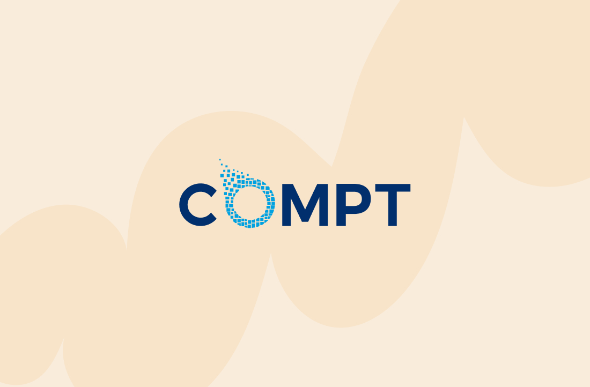

# Compt Overview

  

[Link to Company Website](https://compt.io/)

---
## Contents
1. [Overview](#overview)
1. [Technologies](#technologies)
1. [Features](#features)
1. [Challenges](#challenges)
1. [Successes](#successes)
---

## Overview

I worked at Compt as a **Frontend Software Engineer II** (2022 - 2024). This overview describes my work and the technologies I used. The application source code is private.

Compt manages employee stipends, lifestyle spending accounts (LSAs), reimbursements, rewards, and team recognition. It handles tax treatment and integrates with payroll systems. Customers include MasterClass, Nextdoor, Jellyvision, and Webflow.

> [Back to the top](#compt-overview)
---

## Technologies
  - TypeScript
  - React
  - Redux Toolkit
  - Tailwind CSS
  - Storybook
  - Python / Django (backend)
  - Enzyme / Jest
  - Docker
  - Jira, InVision, Git, code review

> [Back to the top](#compt-overview)
---

## Features

My work at Compt included:

  - **App redesign:** I led the frontend implementation, adding Tailwind CSS and a Storybook component library to the existing React app.

  - **Component library:** I built and documented reusable components in Storybook, working with the product designer from wireframes through final designs.

  - **Admin control center:** I built features for HR teams to configure perks and stipends, manage visibility, and view reports.

  - **Testing:** I added unit and end-to-end tests.

  - **Team support:** I helped colleagues with TypeScript, React, CSS, Tailwind, and Storybook. I also ran standups, presented Lunch & Learns, and mentored teammates on frontend development.

  - **Hiring:** I interviewed and onboarded developers and wrote interview questions and take-home challenges.

> [Back to the top](#compt-overview)
---

## Challenges

The redesign affected nearly every screen in an app customers used daily. I built and documented components in Storybook first, reviewed them with the designer, then migrated screens using the existing tests to check for regressions.

> [Back to the top](#compt-overview)
---

## Successes

The redesign shipped, and the team used the component library for subsequent features. I also took on more frontend leadership through standups, mentoring, and hiring before moving into my senior role at Continuum.

> [Back to the top](#compt-overview)
---

*Bret Merritt · [GitHub](https://github.com/bretm9) · [LinkedIn](https://www.linkedin.com/in/bret-merritt)*
